SparkFun MicroPython Firmware Uploader
========================================

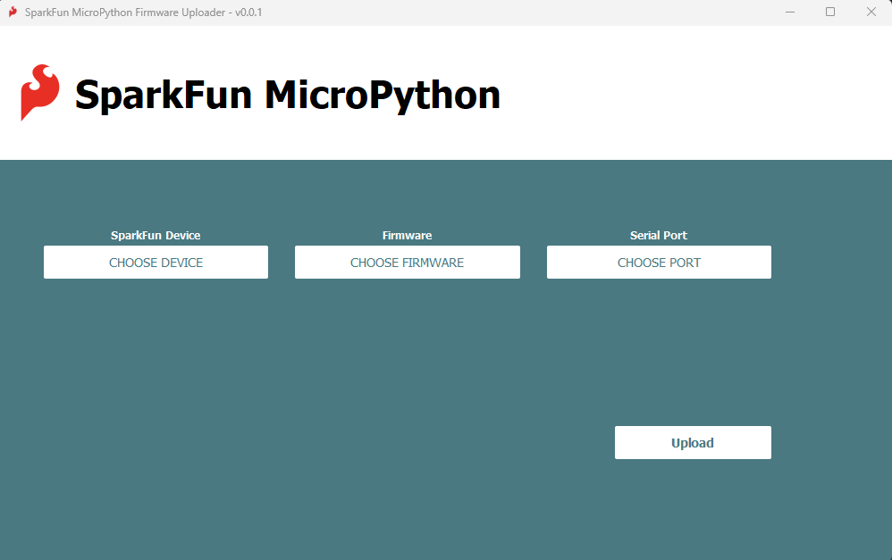

The MicroPython Firmware Uploader is a simple, easy to use method for updating the firmware on SparkFun MicroPython products. Available on all major platforms (Linux, Mac, Windows), as well as a Python package, the Uploader simplifies working with SparkFun MicroPython products. 

# Contents

* [Notes](#notes)
* [Using the MicroPython Firmware Uploader](#using-the-MicroPython-firmware-uploader)
    * [Upload Firmware](#upload-firmware)
* [Installation](#installation)
    * [Windows Installation](#windows)
    * [macOS Installation](#macos)
        * [Install the CH340 USB drivers](#install-the-ch340-usb-drivers)
        * [Download and install the MicroPython Uploader](#download-and-install-the-MicroPython-uploader)
        * [Launch the MicroPython Uploader application](#launch-the-MicroPython-uploader-application)
    * [Linux Installation](#linux)
    * [Python Package](#python-package)
        * [Raspberry Pi](#raspberry-pi)

# Using the MicroPython Firmware Uploader
  
## Upload Firmware
  
* Attach the MicroPython product over USB
* Click the ```CHOOSE PORT``` button and select the correct COM port from the popup menu.

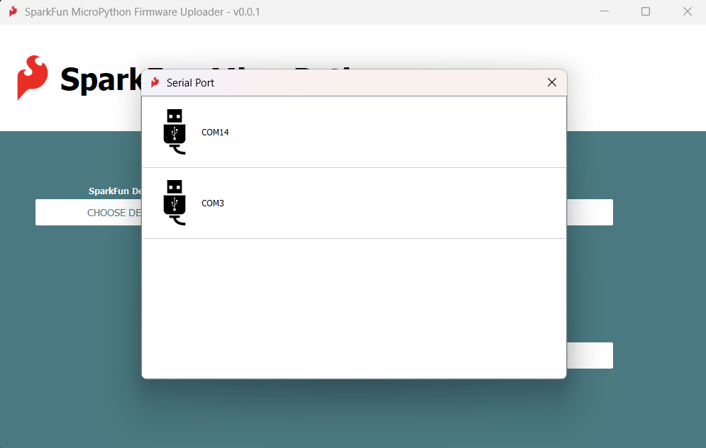

* Click the ```CHOOSE DEVICE``` button and select the correct SparkFun board from the popup menu. If your board is already running MicroPython and you select ```Auto Detect``` the button should automatically resolve to the correct board. If you select `Auto Detect` and the button populates with the text "Auto Detect" instead of resolving to a board name, Auto Detect was unsuccessful and you must manually select your board. 

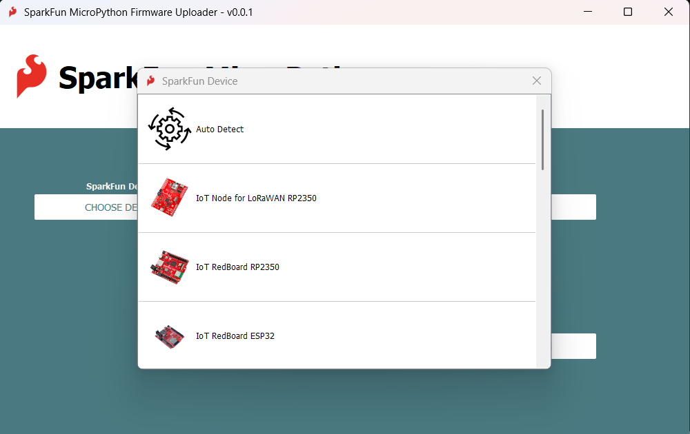

* Click ```CHOOSE FIRMWARE``` and select the firmware file you'd like to upload. Select "Local" if you wish to upload an arbitrary local firmware file from your file system. Otherwise, options will be populated with all the available firmware files for your board from the most recent release in GitHub. Note: Only the local option is available if you are without an internet connection.

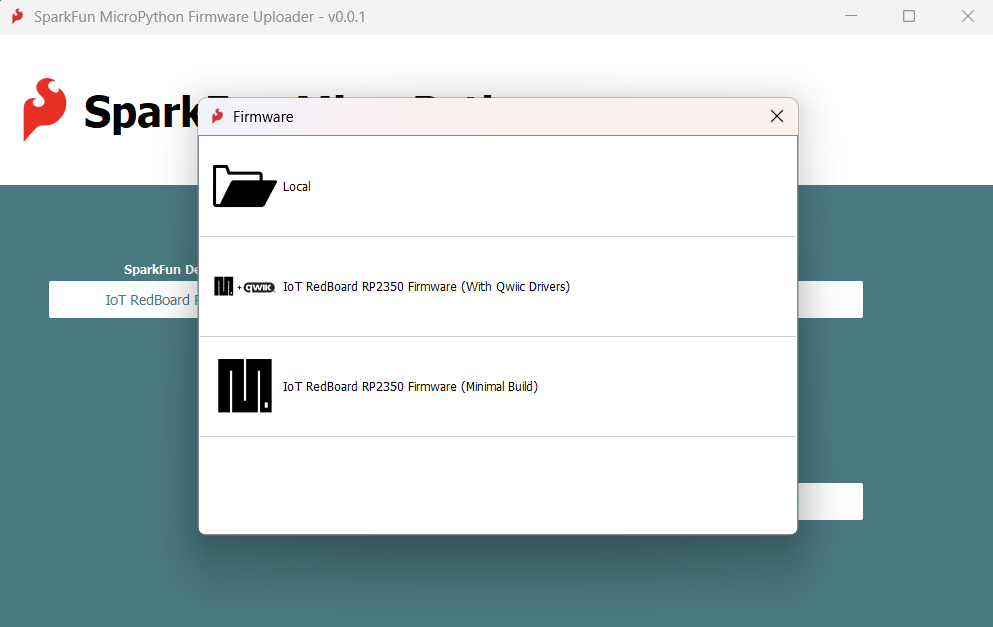

* Click the  ```Upload``` button to update the firmware
* Make sure you approve any permission requests for your OS as they appear.
* If necessary (RP2 and Teensy platforms), follow the popup instructions provided to press physical buttons on your device to enter bootloader mode. NOTE: Make sure you are NOT in bootloader mode prior to clicking the `Upload` button. Your board needs to be enumerated as a serial port at the start of the upload.

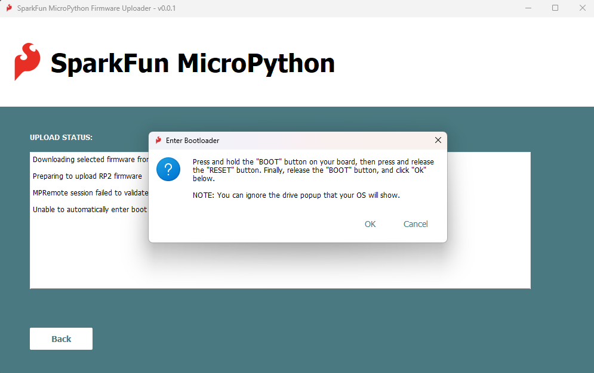


The selected firmware is then uploaded to the connected SparkFun MicroPython product. Upload information and progress are displayed in the `Upload Status` portion of the interface. 


# Installation

Installation binaries are available for all major platforms (macOS, Window, and Linux) on the release page of the MicroPython Uploader GitHub repository:

[**MicroPython Uploader Release Page**](https://github.com/sparkfun/SparkFun_MicroPython_Firmware_Uploader/releases)

Click the arrow next to **Assets** if required to see the installers:

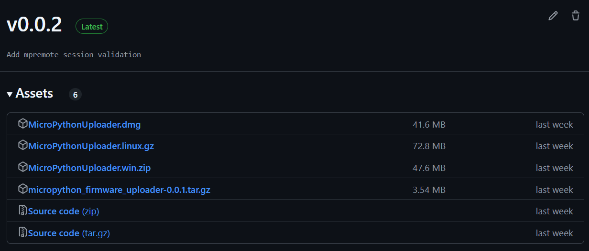


## Windows

* Download the [github release](https://github.com/sparkfun/SparkFun_MicroPython_Firmware_Uploader/releases) zip file - *MicroPythonUploader.win.zip*


* Right-click the *MicroPythonUploader.win.zip* and select "Extract All" to unzip it

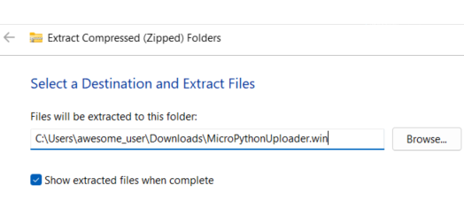

* This results in the application executable, *MicroPythonUploader.exe*


* Double-click *MicroPythonUploader.exe* to start the application
* The executable isn't signed, so you will see a *Windows protected your PC* warning

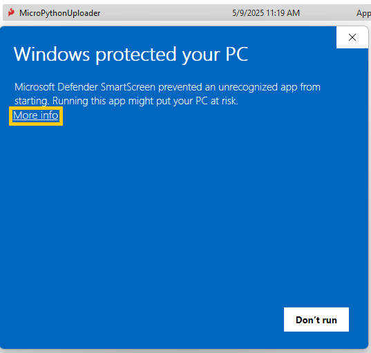

* Click *More info* and *Run anyway* to run the executable

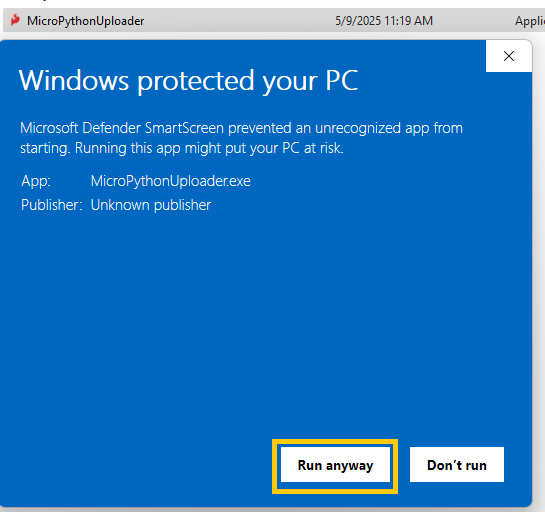

## macOS

### Install the CH340 USB drivers

Before you begin, check you have drivers for the CH340 USB interface chip installed:

* Full instructions can be found in our [CH340 Tutorial](https://learn.sparkfun.com/tutorials/how-to-install-ch340-drivers/all#mac-osx)
* Here is a link to the WCH downloads page for the [CH340 / CH341 macOS driver](https://www.wch-ic.com/downloads/CH341SER_MAC_ZIP.html)
* The Zip file contains more instructions: CH34X_DRV_INSTAL_INSTRUCTIONS.pdf

### Download and install the MicroPython Uploader

To download and install the MicroPython Uploader:

* Download the [github release](https://github.com/sparkfun/SparkFun_MicroPython_Firmware_Uploader/releases) file - *MicroPythonUploader.dmg*


* Click on the Downloads icon, then double-click the *MicroPythonUploader.dmg* file that you downloaded to mount the disk image.

* A Finder window, with the contents of the file will open

* Install the *MicroPythonUploader.app* by dragging it onto the *Applications* folder

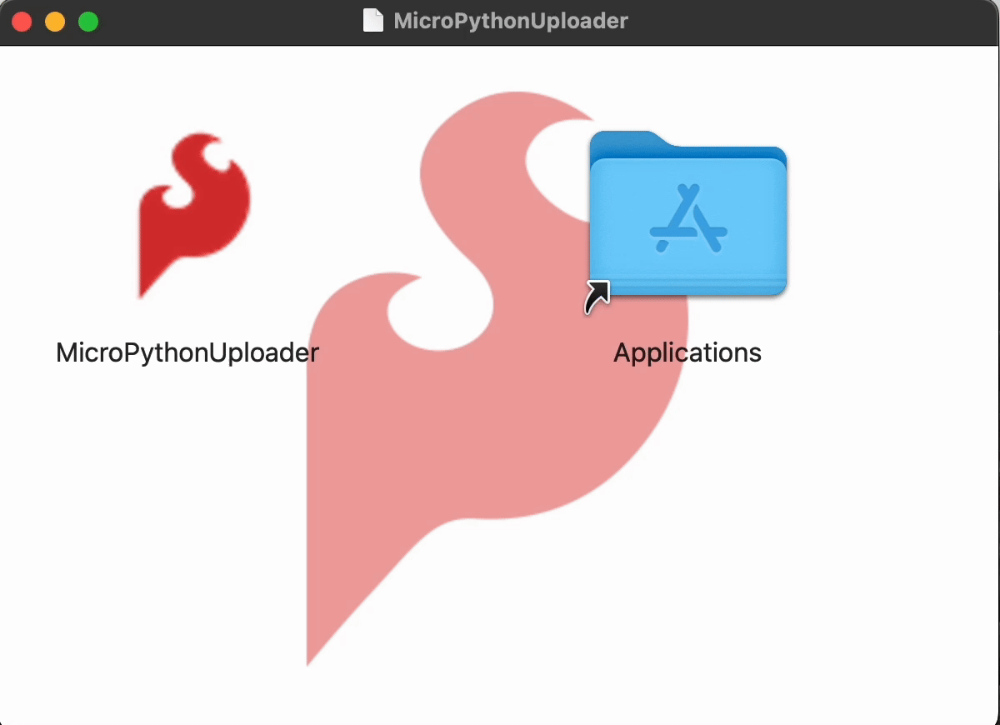

* Unmount the MicroPythonUploader disk image by opening Finder and ejecting it

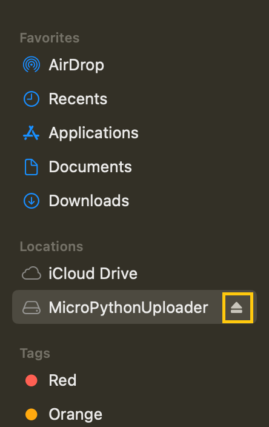

### Launch the MicroPython Uploader application

To launch the MicroPython Uploader application:

* Double-click MicroPythonUploader.app to launch the application

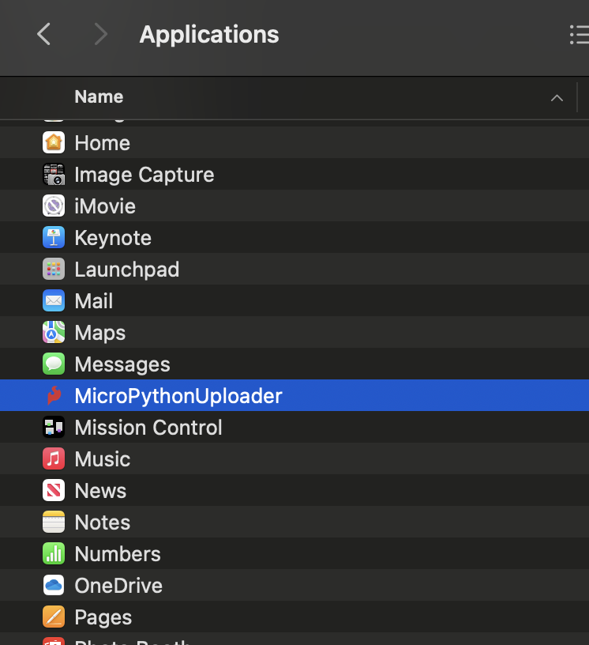

* The MicroPythonUploader.app isn't signed, so macOS won't run the application, and will display a warning dialog. Click **Done**

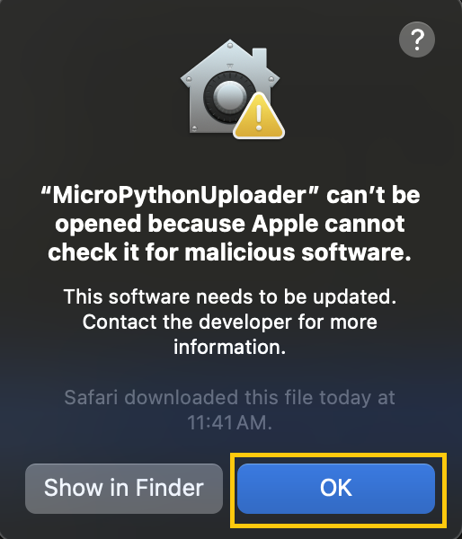

* To approve app execution bring up the macOS *System Settings* and navigate to *Privacy & Security*
* On this page, select the *Open Anyway* button to launch the MicroPythonUploader application

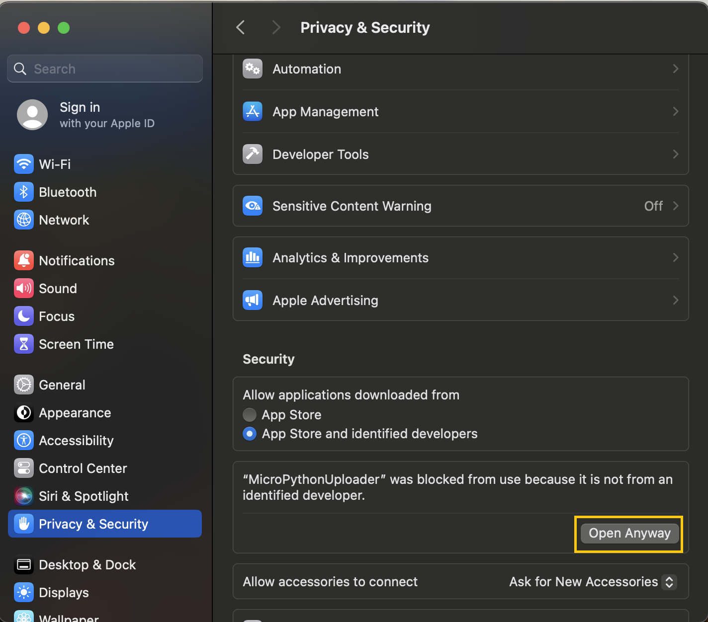

* Once selected, macOS will present one last dialog. Select **Open Anyway** to run the application

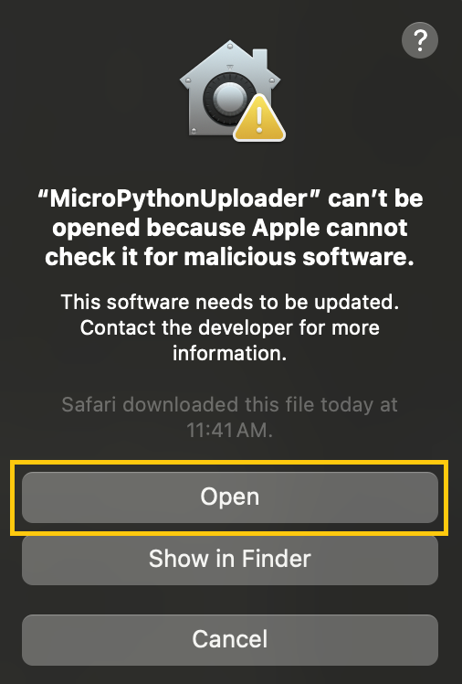

* Enter your password and click OK. The MicroPythonUploader will now start

## Linux

* Download the [github release](https://github.com/sparkfun/SparkFun_MicroPython_Firmware_Uploader/releases) file - *MicroPythonUploader.linux.gz*
* Un-gzip the file, either by double-clicking in on the desktop, or using the `gunzip` command in a terminal window. This results in the file *MicroPythonUploader* 
* To run the application, the file must have *execute* permission. This is performed by selecting *Properties* from the file right-click menu, and then selecting permissions. You can also change permissions using the `chmod` command in a terminal window
* Once the application has execute permission, you can start the application a terminal window. Change directory's to the application location and issue `./MicroPythonUploader`
* You may need to install drivers for the CH340 USB interface chip. Full instructions can be found in our [CH340 Tutorial](https://learn.sparkfun.com/tutorials/how-to-install-ch340-drivers/all#linux)

## Python Package

The MicroPython Firmware Uploader is also provided as an installable Python package. This is advantageous for platforms that lack a pre-compiled application. 

To install the Python package:
* Download the package file - *python-install-package.zip*
* Unzip the github release file. This results in the installable Python package file - *MicroPython_Firmware_Uploader-1.6.0.tar.gz* (note - the version number might vary)

At a command line - issue the package install command:

* `pip install MicroPython_Firmware_Uploader-1.6.0.tar.gz`
* Once installed, you can start the MicroPython Uploader App by issuing the command `./MicroPython_Formware_Upload` at the command line. (To see the command, you might need to start a new terminal, or issue a command like `rehash` depending on your platform/shell)

Notes:
* A path might be needed to specify the install file location.
* Depending on your platform, this command might need to be run as admin/root
* Depending on your system, you might need to use the command `pip3`
